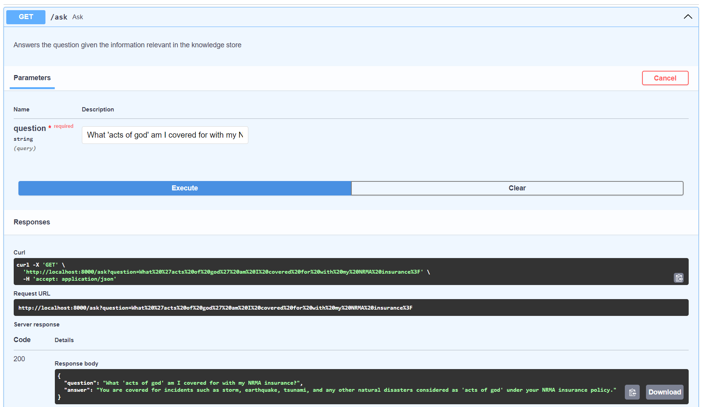
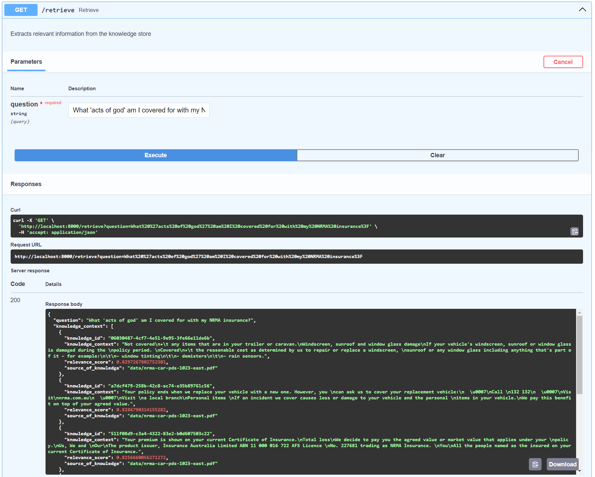
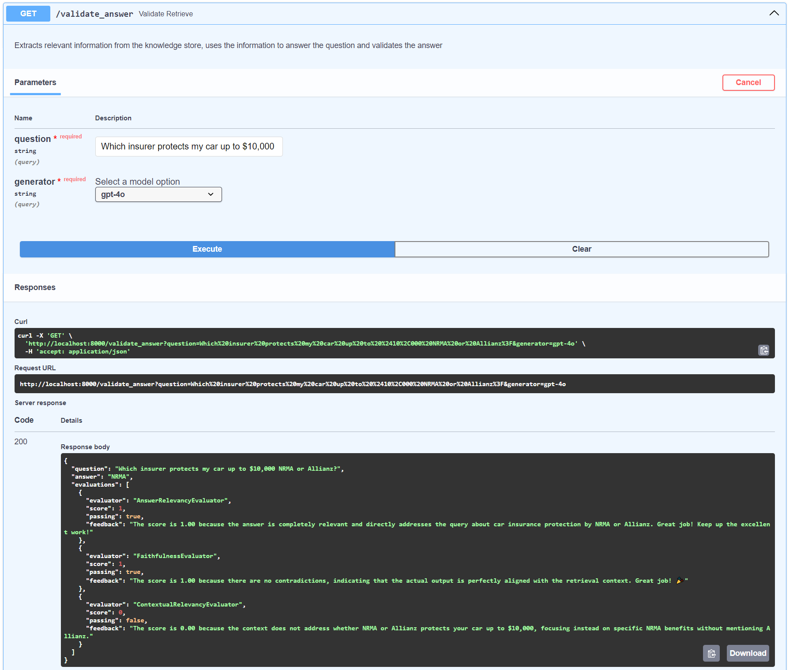

# Relevance.ai RAG project

## How to run the project locally

1. Clone repo and create a `.env` file in the root directory with your `OPENAI_API_KEY=sk...` in it.
2. Create python environment using poetry: `poetry shell` + `poetry install`.
    - If your system throws errors here, you could try deleting the poetry.lock file and installing different versions of the required packages.
3. You can then run the Fast API server through the following command: `poetry run python app.py`.
    - Once up and running, head to `0.0.0.0:8000/docs` (or sometimes required: `localhost:8000/docs`) and explore the endpoints!
4. Alternatively you can run __main__.py via `poetry run python __main__.py` to run a single instance run of various parts of the code.

*Note: editing or saving any file will cause the fastAPI server to restart. This is very slow (be patient) as it has to reload both brains from scratch each time.*

## Objectives

- Create at least 2 retrieval frameworks.
- Create at least 2 generation frameworks.
- Create at least 2 evaluation frameworks and compare the two pipelines.

## Goals

- Get it working
- Atomise each retrieval, generation and evaluation object
- Use interfaces to enable each object to be swapable for another without the pipeline needing to know the specific implementation
- Use factory patterns to separate instantiation and use

To measure if the goals have been achieved, I should be able to have 8 different pipelines using a single retriever, generator and evaluator (2x2x2).

## Try some of these questions

- What 'acts of god' does my NRMA insurer cover my car for?
- I have Third Party Fire & Theft insurance under the allianz policy. What is the most they will repay me for my car?

### edge case failing questions

- Who should I insure my car with for the best coverage; NRMA or Allianz?
- Which insurer protects my car up to $10,000 NRMA or Allianz? (only selects context from NRMA)

## API Endpoints

### Ask endpoint to get an answer from an LLM to your question

### Retrieve endpoint to get the top 6 context blocks from the knowledge store for your given question

### Validate answer endpoint for a complete end to end, question, context, answer and validation pipeline

